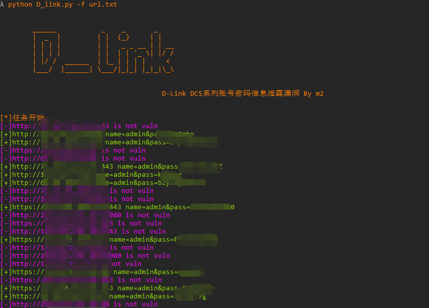

# D-Link DCS系列账号密码信息泄露漏洞
D-Link DCS系列账号密码信息泄露漏洞，通过脚本获取账号密码登录。

## 漏洞编号

CVE-2020-25078

## 工具利用

python3 CVE-2020-25078.py -u http://127.0.0.1:1111 单个url测试

python3 CVE-2020-25078.py -f url.txt 批量检测

## 免责声明

由于传播、利用此文所提供的信息而造成的任何直接或者间接的后果及损失，均由使用者本人负责，作者不为此承担任何责任。
